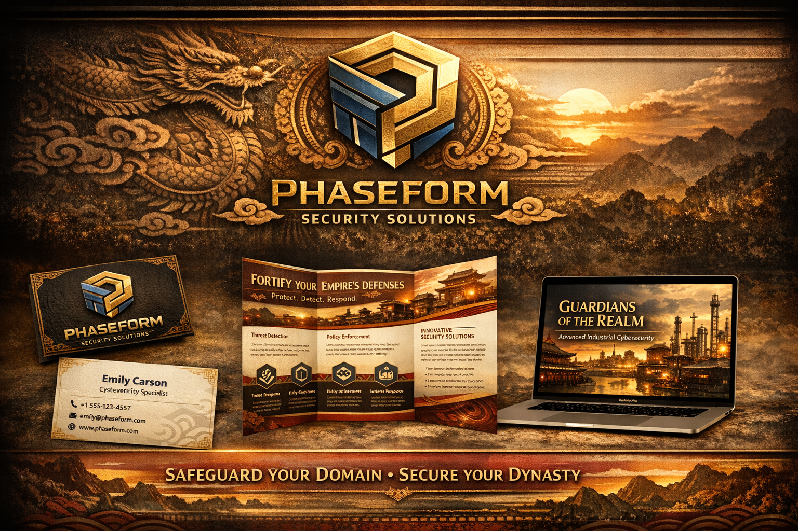

<div align="center">
  

  <h1>Linguistic Encryption System · Celestial</h1>
  <p><strong>Evidence-bounded sovereign AI runtime.</strong> Defensive-only. Provenance-first.</p>
  <p><em>Phaseform Security Solutions — Safeguard your Domain · Secure your Dynasty</em></p>
</div>

---

## What this repository is

This repository contains the **Celestial runtime package** — a policy-driven, signature-verified execution shell for evidence-bounded AI agents operating under the **Architect's Manifesto** constraints (ECTI, CSM, STL, KAQ). The centerpiece is the **Aletheia Lattice Operational System Prompt v1.0**, a production specification for reasoning that separates archive evidence from live telemetry from forecast scenarios, attaches provenance and confidence to every substantive claim, and refuses to silently promote content between temporal channels.

The runtime ships as a set of cooperating Python modules: a policy packager that encrypts and signs governance templates, a watcher that activates only packs whose Ed25519 signatures verify against a trusted public key, a rotator that performs atomic swaps with rollback, a release-manifest signer for cross-team handoffs, a contradiction-check scaffold, and the `celestial_agent` cryptographic core. Every mutation lands in an append-only audit log.

## The defensive-only posture, stated once and for real

This codebase implements **defensive security primitives only**. It deliberately does not include an autonomous deception engine, offensive toolchain, or any component designed to attack a system rather than defend one. The closest thing in the repo, `deception_review_stub.py`, is exactly what the name says — a review stub with supervised, local-only scaffolding so the governance question can be studied under human oversight before any capability is ever built. This constraint is encoded directly in the Aletheia Lattice prompt (`prompts/aletheia_lattice_operational_system_prompt_v1.md`) and in every policy template that references it: `capabilities.can_generate_code = false`, `governance.defensive_only = true`. Pull requests that attempt to change either flag will not be accepted.

## The Aletheia Lattice prompt, in one paragraph

When an agent is instantiated under the Aletheia Lattice prompt, it operates with three evidence channels that never bleed into each other. The **Archive Channel** carries immutable historical evidence with explicit time labels. The **Live Channel** carries current operational data with freshness markers. The **Forecast Channel** carries projections and simulations that are always explicitly announced as "scenario projection, not observed fact." Before any substantive claim is promoted to the user, it runs through five parallel checks — causal, constraint, probabilistic, synthesis, and contradiction — and the five-state immune layer (VOID → TRACE → CAUTION → GRAVE → CONDEMNED) governs what the agent will and will not do at each risk level. Read the full specification at [`prompts/aletheia_lattice_operational_system_prompt_v1.md`](prompts/aletheia_lattice_operational_system_prompt_v1.md).

## Quickstart

```bash
python -m venv .venv && source .venv/bin/activate
pip install -r requirements.txt

# Package the Aletheia Lattice operational prompt as a signed policy pack
python template_packager.py \
  --template aletheia_lattice_operational_prompt_v1 \
  --name aletheia_lattice_operational_prompt_v1_pack \
  --passphrase 'your-strong-passphrase'

# Create a signed release manifest for cross-team handoff
python release_manifest.py \
  --template aletheia_lattice_operational_prompt_v1 \
  --pack-name aletheia_lattice_operational_prompt_v1_pack \
  --release-name aletheia_lattice_operational_prompt_v1_release \
  --release-notes "Operational prompt v1.0 — evidence-bounded, defensive-only."

# Export an end-to-end handoff bundle (template + encrypted pack + signatures)
python handoff_bundle.py \
  --pack-name aletheia_lattice_operational_prompt_v1_pack \
  --release-name aletheia_lattice_operational_prompt_v1_release \
  --include-template
```

Smoke-test the full path end-to-end with `python _smoke_operational_prompt_v1.py`. The test asserts that the prompt artifacts exist, the pack encrypts, the manifest signs and verifies against the embedded public key, and the bundle zip contains exactly the expected payload set.

## Repository map

The `prompts/` directory holds the Aletheia Lattice specification in both narrative (`.md`) and structured (`.json`) form. The `policy_templates/` directory holds policy templates that reference those prompts and declare governance constraints — `aletheia_lattice_operational_prompt_v1.json` is the canonical one. The `celestial_agent/` package holds the cryptographic core (`agent_spec_crypto.py`) that underwrites every signature in the system. The `docs/` directory contains architecture notes including the threat-control matrix and the deception simulation guardrails. Everything at the top level is a runtime module: the packager, the watcher, the rotator, the manifest signer, the risk profiler, the audit viewer, and the smoke tests that keep it honest.

The `branding/phaseform/` directory carries the Phaseform Security Solutions visual system — both the **Guardians of the Realm** gold-and-dragon treatment for external/consumer-facing material and the tech-blue treatment for enterprise-facing material. Usage guidelines live in [`branding/BRANDING.md`](branding/BRANDING.md).

## Governance

Every substantive action in this runtime is gated by a signed policy pack. Private keys live outside the repository — the `keys/` directory is a `.gitignore`d placeholder so the runtime can find its key path after clone, but the actual key material is never committed. Do not commit a `creator_private_key.b64` or any file ending in `.enc` or `.sig` produced locally; the `.gitignore` will catch them, but the rule is cultural before it is mechanical. Consequential actions such as policy changes and sensitive tool activation require human approval per the policy template's `governance.human_approval_required_for` list.

## License

MIT — see [`LICENSE`](LICENSE).

---

<div align="center">
  
  <br/>
  <sub>Part of the <strong>GoodShyt Group</strong> sovereign-AI stack — aligned with NIST AI RMF 1.0, NIST GenAI Profile, CISA Secure-by-Design, and FIPS 203 / 204 / 205.</sub>
</div>
