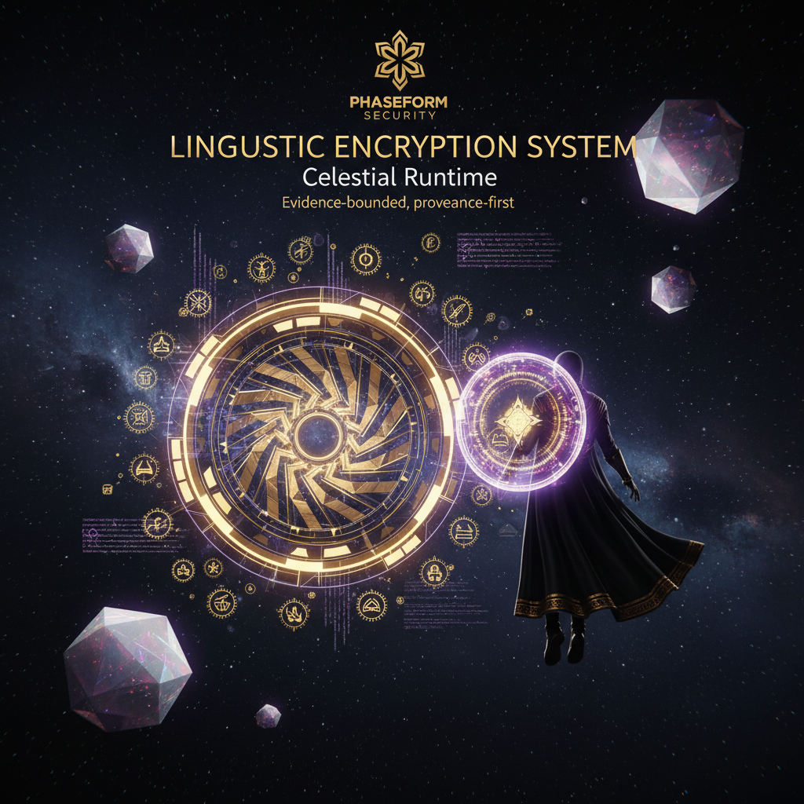
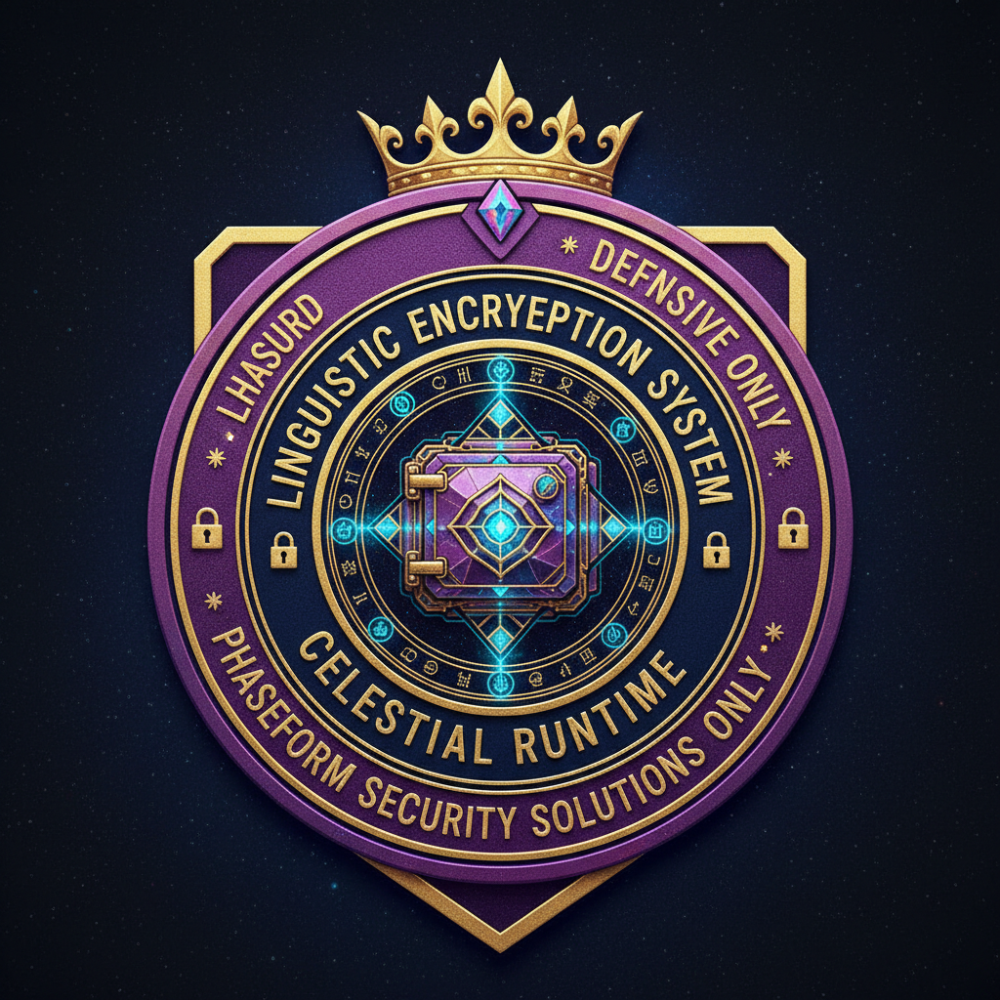

<p align="center">
  
</p>

<p align="center">
  <a href="https://github.com/DeontewattsV1/Linguistic-Encryption-System-Celestial-/actions/workflows/ci.yml">
    
  </a>
  
  
  
</p>

<h1 align="center">Linguistic Encryption System · Celestial</h1>
<p align="center"><strong>Evidence-bounded sovereign AI runtime. Defensive-only. Provenance-first.</strong></p>
<p align="center"><em>Phaseform Security Solutions -- Safeguard your Domain. Secure your Dynasty.</em></p>

<p align="center">
  
</p>

---

## What this is

The **Celestial runtime** is a policy-driven, signature-verified execution shell for evidence-bounded AI agents operating under the **Architect's Manifesto** constraints (ECTI, CSM, STL, KAQ).

The centerpiece is the **Aletheia Lattice Operational System Prompt v1.0**, a production specification for reasoning that:
- Separates archive evidence from live telemetry from forecast scenarios
- Attaches provenance and confidence to every substantive claim
- Refuses to silently promote content between temporal channels

### Modules

| Module | Purpose |
|:---|:---|
| `celestial_agent/` | Cryptographic core -- Ed25519 signing, policy encryption |
| `orchestrator.py` | Top-level runtime loop |
| `policy_rotator.py` | Atomic pack swaps with rollback |
| `vault_watcher.py` | Activates only signature-verified packs |
| `manifest_verifier.py` | Cross-team handoff signature verification |
| `release_manifest.py` | Release manifest signer |
| `profile_manager.py` | Runtime profile configuration |
| `rotation_guard.py` | Guards atomic rotation state |

### Defensive-Only Posture

This codebase implements **defensive security primitives only**. The `deception_review_stub.py` is a supervised, local-only review scaffold -- not an autonomous deception engine.

---

## Quickstart

```bash
git clone https://github.com/DeontewattsV1/Linguistic-Encryption-System-Celestial-
cd Linguistic-Encryption-System-Celestial-
pip install -r requirements.txt

# Run smoke tests
python _smoke_test.py

# Start vault watcher
python vault_watcher.py
```

---

## Related Projects

- [Ethos-Aegis-](https://github.com/DeontewattsV1/Ethos-Aegis-) -- Sovereign AI Immune Architecture
- [self-improving-agent](https://github.com/DeontewattsV1/self-improving-agent) -- Continuous learning agent

---

MIT (c) [GoodShyt Group](https://github.com/DeontewattsV1)